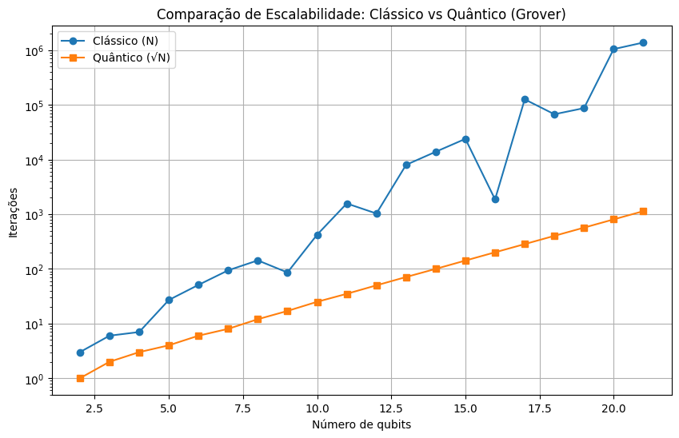

# Grover's Algorithm

Work developed for the **Qiskit Fall Fest 2025 Hackathon**, where my team and I implemented **Grover's Algorithm** and performed measurements on random numbers of different bit sizes.

In this project, we implemented **Grover's Quantum Search Algorithm** to perform a search over a solution space of size ($2^n$), where ($n$) represents the number of qubits.  
The goal is to find a specific password (or target state) with a **quadratic speedup** compared to a classical brute-force search.

The process follows the steps below:

## 1. Password Generation
A random password of ($n$) bits is generated, representing the target state we aim to find within the search space.

## 2. Circuit Initialization
We create a quantum circuit with ($n$) qubits and apply a **Hadamard (H)** gate to each of them.  
This places all qubits in a **uniform superposition**, meaning all possible bit combinations (from \(0\) to ($2^n - 1$)) have the same initial probability of being measured.

Mathematically, the initial state after this step is:

$$
|\psi_0\rangle = H^{\otimes n} |0\rangle^{\otimes n} = \frac{1}{\sqrt{2^n}} \sum_{x=0}^{2^n - 1} |x\rangle
$$

## 3. Main Loop — Grover Iterations
In this step, we repeatedly apply two fundamental operations of the algorithm:

### a) Oracle
The oracle is a quantum operation that **marks the desired state** by inverting the sign of its amplitude through a phase shift.

$$
O|x\rangle = 
\begin{cases} 
-|x\rangle, & \text{if } x = x_0 \\
|x\rangle, & \text{otherwise}
\end{cases}
$$

In our implementation, this marking is achieved using **X**, **H**, and **multi-controlled X (MCX)** gates, which activate only when all qubits match the password pattern.

### b) Diffuser (Amplitude Amplifier)
After the oracle, we apply the **diffuser**, also known as **inversion about the mean**.  
This operation amplifies the probability of the marked state and decreases that of all others.

Mathematically:

$$
D = 2|\psi_0\rangle\langle\psi_0| - I
$$

In practice, the diffuser is implemented again with **Hadamard**, **X**, and a central **MCX** gate — mirroring the oracle’s structure but acting on all states.

## 4. Iterations
The oracle and diffuser steps are repeated approximately \(k\) times, where \(k\) is given by:

$$
k \approx \frac{\pi}{4} \sqrt{2^n}
$$

This value of ($k$) maximizes the probability of measuring the correct state, as mathematically demonstrated in Grover’s proof.

## 5. Measurement and Result
Finally, we measure the ($n$) qubits.  
With high probability, the measured result corresponds to the original password generated at the beginning of the experiment.

The success probability after ($k$) iterations is given by:

$$
P = \sin^2\left((2k + 1)\theta\right), \quad \text{where } \sin(\theta) = \frac{1}{\sqrt{2^n}}
$$

We compared this quantum process with a **classical brute-force search**, which checks all possible passwords sequentially.  
The contrast clearly shows the **quadratic advantage** of the quantum approach.

---

## Results and Discussion

As expected, we obtained an **approximate quadratic speedup** compared to the classical algorithm.

`(Data generated by our simulator)`

The number of qubits we can simulate on a classical computer is limited by the large amount of memory required.  
Even so, this experiment illustrates how **Quantum Computing** can be significantly more efficient than classical computation.

By exploring the **wave-like properties** of qubits and leveraging quantum systems to approximate multiple results simultaneously, we can tackle complex problems exponentially faster than on classical hardware.  
This demonstrates how **Quantum Physics** opens the door to applications in **Cybersecurity**, **Cryptography**, **Data Analysis**, and **Applied Mathematics**.

However, the simulation time grows exponentially with the number of qubits, and running a quantum algorithm on classical hardware can be slower than its classical counterpart.  
Additionally, **noise** and **physical imperfections** in real quantum hardware can reduce the precision of measurements.

---

## Future Work

As an extension of this project, we plan to implement a **quantum password system** that supports any type of character — including numbers, letters, and special symbols — thereby expanding the search space and making the experiment closer to a real-world digital security scenario.

Furthermore, we aim to develop an **oracle based on validation rules**, rather than direct password decoding, aligning the model with **verification-based problems** found in modern cryptographic systems.
